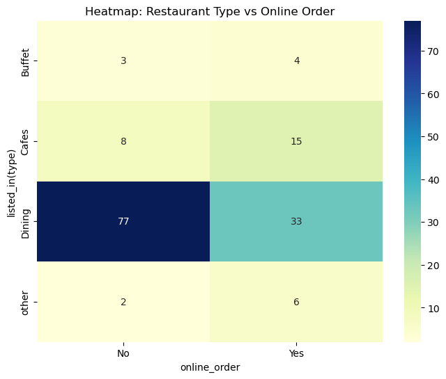
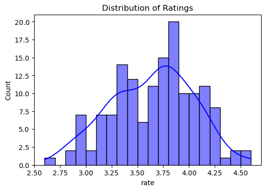
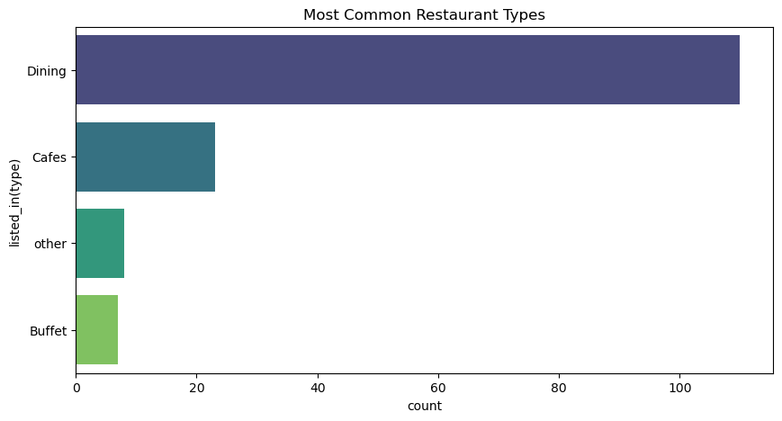
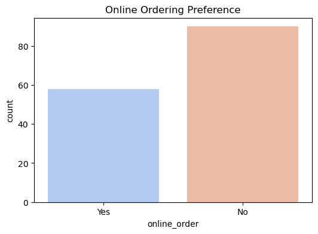
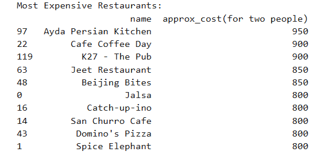
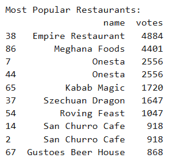

# 🍽️ Zomato Data Analysis Project

## 📌 Overview
This project explores **Zomato restaurant data** using **Python, Pandas, Seaborn, and Matplotlib**. It provides insights into:
- Customer ratings distribution ⭐
- Online orders vs. Dine-in preferences 📊
- Most common restaurant types 🏢
- Most expensive and most popular restaurants 💰🔥
- Heatmaps and visual analytics 🎨

🔍 Key Issues Identified in Your Notebook
Data Cleaning Required

Ratings column has mixed formats (4.1/5, 3.8, etc.), needs cleaning.
Better Visualizations Needed

Add colorful heatmaps, seaborn styling.
Improve labels and titles for readability.
More Insights Can Be Derived

Compare online order vs. dine-in popularity.
Analyze restaurant types and their average ratings.
Identify most expensive vs. most popular restaurants.

## 📂 Project Structure
```
📂 Zomato_Data_Analysis
 ├── 📜 README.md  # Documentation
 ├── 📜 Zomato_DataAnalysis.ipynb  # Jupyter Notebook
 ├── 📜 Zomato_DataAnalysis.html  # Static HTML for GitHub
 ├── 📊 Zomato-data-.csv (Dataset)
 ├── 📂 images/ (Visualization Screenshots)
 ├── 📜 requirements.txt (Dependencies)
 ├── 📜 LICENSE (Optional)
```

## 📊 Visualizations
### 🔥 Heatmap - Online Orders vs Restaurant Type


### 📈 Ratings Distribution


### 🏢 Most Common Restaurant Types


### 📊 Online Orders vs Dine-in Preferences


### 💰 Most Expensive Restaurants


### 🔥 Most Popular Restaurants by Votes


## 🚀 Installation & Setup
1️⃣ Clone the repository:
```bash
git clone https://github.com/gaurav-gitupload/Zomato_Data_Analysis.git
cd Zomato_Data_Analysis
```

2️⃣ Install dependencies:
```bash
pip install -r requirements.txt
```

3️⃣ Open the Jupyter Notebook:
```bash
jupyter notebook
```

## 🔗 Live Notebook Preview
View this project interactively using Google Colab:
[](https://colab.research.google.com/github/gaurav-gitupload/Zomato_Data_Analysis/blob/main/Zomato_DataAnalysis.ipynb)

## 📜 License
This project is open-source under the **MIT License**. Feel free to use and modify it!

## ⭐ Support the Project
If you found this helpful, please **star ⭐ this repo** and share it! 😊


